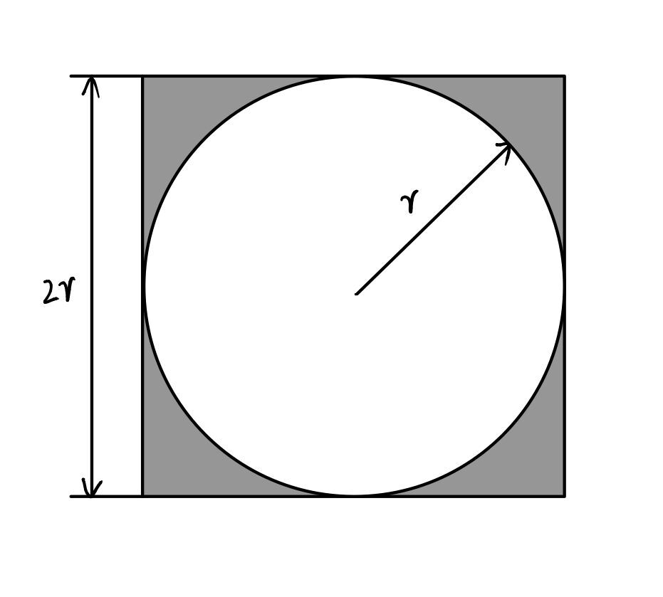
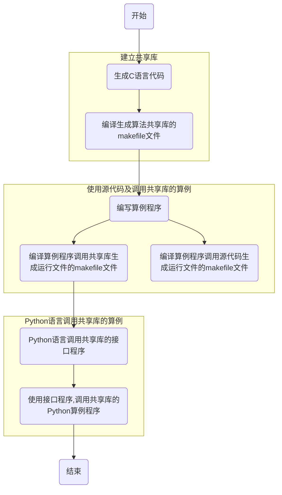
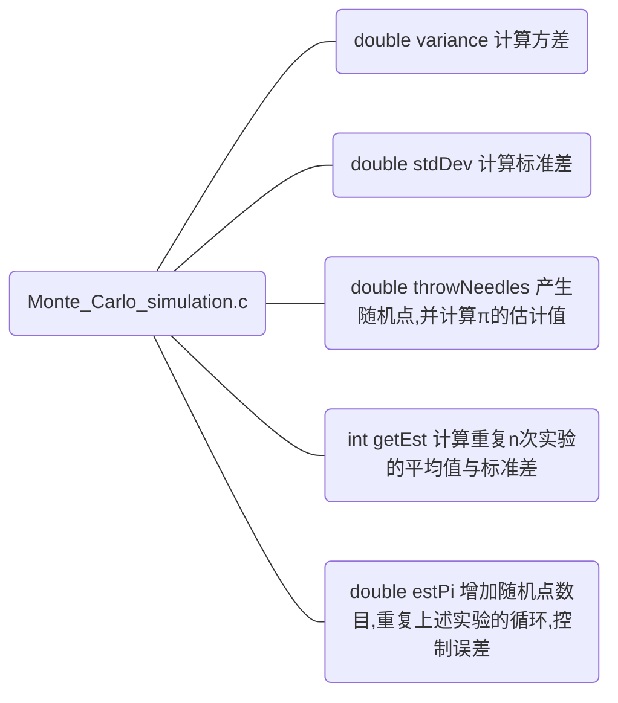
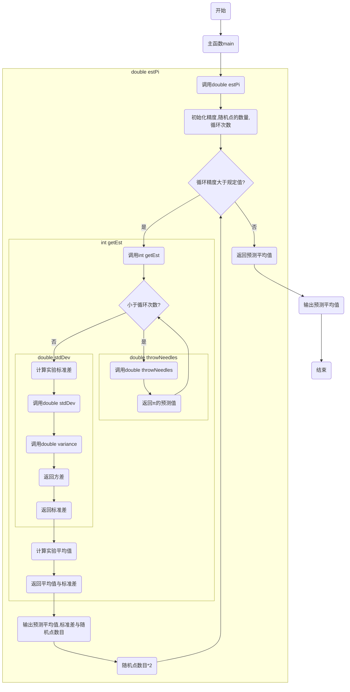

# Practice3设计工作文档

**03017222 杨琰鑫**

## 1. 算法说明
### 1.1 方法简介

蒙特·卡罗方法（Monte Carlo method），也称统计模拟方法，是由大名鼎鼎的数学家冯·诺伊曼提出的。蒙特卡罗是一个地名，位于赌城摩纳哥，象征概率。蒙特·卡罗方法是二十世纪四十年代中期由于科学技术的发展和电子计算机的发明，而被提出的一种以概率统计理论为指导的一类非常重要的数值计算方法。是指使用随机数（或更常见的伪随机数）来解决很多计算问题的方法。与它对应的是确定性算法。蒙特·卡罗方法在金融工程学，宏观经济学，计算物理学（如粒子输运计算、量子热力学计算、空气动力学计算）等领域应用广泛。

### 1.2 计算圆周率π的原理

一个正方形内部相切一个圆，圆和正方形的面积之比是π/4，如图：


在这个正方形内部，随机产生n个点（这些点服从均匀分布），计算它们与中心点的距离是否大于圆的半径，以此判断是否落在圆的内部。统计圆内的点数，与n的比值乘以4，就是π的值。理论上，n越大，计算的π值越准。

## 2. 程序设计工作简要说明

### 2.1 总体思路

程序设计的总体思路如下：



### 2.2 算法程序整体执行过程

算法程序为Monte_Carlo_simulation.c

其中包含的函数体如下：



工作流程图如下：


### 2.3 共享库及算例的工作过程和结果

* 主程序**stat.c**代码如下：
```
#include <stdio.h>
#include "monte.h"


int main()
{   
    double vPi=estPi(0.01,100);
    printf("The vPi = %.5lf",vPi);
    return 0;
}
```

* 编译共享库的makefile文件**makefile-dll.mk**代码如下：
```
CC=gcc
CFLAGS=-O3 -Wall -fPIC

SRCDIR= ./src/
OBJDIR= ./obj/
BINDIR= ./bin/
INCDIR= ./include/

# Linux
# LIB=libsimulation.so 
LIB=libsimulation.dll

SRCS=$(SRCDIR)Monte_Carlo_simulation.c

# non-path filename
filename=$(notdir $(SRCS))

# the obj target of a source code using the pattern rule
OBJS=$(patsubst %.c,$(OBJDIR)%.o,$(filename))

all:$(LIB)
    
$(LIB): $(OBJS)  
	$(CC) -shared -o $(BINDIR)$@ $(OBJS) 

# the pattern rule: one step rule for multiple source files
$(OBJS):$(SRCS)
	$(CC) $(CFLAGS) -o $@ -c $<  -I$(INCDIR)
```

在终端编译该文件，生成**libsimulation.dll**文件，过程及结果如下：


* 调用**源文件**生成运行文件的makefile文件**makefile**代码如下：
```
CC=gcc

SRCDIR= ./src/
OBJDIR= ./obj/
BINDIR= ./bin/
INCDIR= ./include/

#SRCS=$(SRCDIR)Monte_Carlo_simulation.c \ 
#	$(SRCDIR)stat.c 

SRCS=$(wildcard $(SRCDIR)*.c)

# non-path filename
filename=$(notdir $(SRCS))

# the obj target of a source code using the pattern rule
OBJS=$(patsubst %.c,$(OBJDIR)%.o,$(filename))

all:soucestat
	./bin/soucestat
    
soucestat: $(OBJS)  
	$(CC) -o $(BINDIR)$@ $(OBJS) 

$(OBJS):$(SRCS)
	$(CC) -o $@ -c $(SRCDIR)$(patsubst  %.o,%.c,$(notdir $@))  -I$(INCDIR)

clean:
	 del .\obj\stat.o
```

在终端编译该文件，生成**soucestat.exe**文件，并输出预测π值，过程及结果如下：


* 调用**共享库**生成运行文件的makefile文件**makefile-exe.mk**代码如下：
```
SRCDIR= ./src/
OBJDIR= ./obj/
BINDIR= ./bin/
INCDIR=./include/

all: dllstat
	./bin/dllstat

dllstat: statobj  
	gcc -o $(BINDIR)dllstat $(OBJDIR)stat.o -L$(BINDIR) -lsimulation
#	gcc -o $(BINDIR)statApp $(OBJDIR)statApp.o -L$(BINDIR) -lstat -Wl,-rpath=./bin/  

statobj: $(SRCDIR)stat.c 
	gcc -c -o $(OBJDIR)stat.o $(SRCDIR)stat.c -I$(INCDIR)

clean:
	 del .\obj\stat.o
```

在终端编译该文件，生成**dllstat.exe**文件，并输出预测π值，过程及结果如下：


* Python语言调用共享库的接口程序**simulation.py**代码如下：
```
from ctypes import *

flib = cdll.LoadLibrary("../bin/libsimulation.dll")
prototype = CFUNCTYPE(c_double,c_double,c_double)

def estPi(a,b):
    f=prototype(("estPi",flib))
    result=f(a,b)
    return result
```

* 使用接口程序，调用共享库的Python算例程序**run.py**代码如下：
```
from simulation import *

vPi = estPi(0.01,100)
print("The vPi = %.5f"%vPi)
```
在终端编译该文件，输出预测π值，过程及结果如下：


# 3. 工作小结

C语言具有**代码量小、计算速度快**的优势，当软件工程量较大时，这样的优势会更加明显，可以大大减小程序占用的空间和运行时间。

然而，C语言语法的特点使得它在编译时可能会出现不明原因的错误，产生漏洞，**危险性较高**；C语言是面向过程的语言，所以在编写较大项目时，代码数目变多很容易引起崩溃，这时候就需要用另外一种思想将整个程序的框架重新设计一下，即用面向对象的思想设计，令C语言**开发周期较长**。这使得C语言学习难度偏高、不易上手，在应用层面不如Python、Java等普遍。

大型软件中，C语言的优点往往不可忽视，而C语言的共享库为其他语言提供了调用C语言程序的接口。库用于将相似函数打包在一个单元中。然后这些单元就可为其他开发人员所共享，并因此有了模块化编程这种说法。以C语言程序为内核，其他语言程序作为外壳的软件，既满足了程序与硬件快速的信息交换，也简化了用户和开发者对程序使用、修改、完善的工作量。

在这次的编程过程中，我遇到了一些编译器未报错的错误：

在编写makefile文件时出现了对函数的重复定义，这使我认识到除正确使用头文件以外，还应对不同源文件之间的关系有明确的认识，这好比要搭建一个正确的思维框图，决定着整个程序的基础框架，之后函数的编写和编译才会有清晰的思路。

在算法程序的编译中，我曾出现estPi（）函数的循环体只循环一次、throwNeedle（）函数中的随机数多次重复，导致输出结果并不理想，在仔细检查与调试过程中，我发现需将srand(time(NULL))随机种子置于throwNeedle（）函数之外才能产生理想的随机数，查阅相关资料后了解到，以目前计算机的计算速度，srand()的计时精度已经不够用了，若放在某个循环体内，反复初始化很容易造成随机数重复，所以一般只初始化一次。这让我对C语言语句位置的规范性以及软件与硬件的联系又有了更为深刻的认识。

总结：老师曾说“软件设计不仅是技术，也是艺术”，于我而言，软件的设计也是对自己思维逻辑性的一种锻炼。跟随着计算机语言而思考的计算思维更加具有条理性，而这未尝不是对自己思考其他问题方式的一种启发。