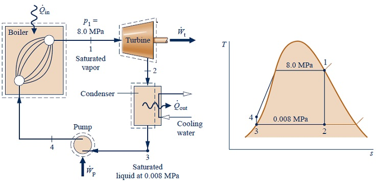
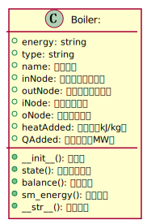

# Practice2设计工作文档 

**03017222 杨琰鑫**

## 1. 设计问题简要描述

### 1.1 设计问题：

参考PyRankine，使用python语言设计一个通用的能量平衡计算软件来分析以下循环：
* [eg 8.1：理想朗肯循环](./rankine81.md)
* [eg 8.5：含一个开式给水加热器的回热循环](./rankine85.md)
* [eg 8.6：含两个给水加热器的再热-回热循环](./rankine86.md) 
  
### 1.2 设计任务：

**数据文件和python3源码**

* 数据文件：建立描述循环设备和系统的json文件
* python3源码：
  * 使用类描述循环中的设备(组件)、节点
   * 编程读取系统描述json文件，解析其描述的循环系统，进行循环的能量平衡分析
* 数据文件：输出分析结果到数据文件
  
## 2. 程序设计方案简要描述

### 2.1 总体思路：
可将循环中的所有设备通过若干个节点（Node）连接起来（以eg 8.1中理想朗肯循环为例）：


则分析循环可以转换成求解循环中各个设备与节点的参数。软件总体结构如下：


数据计算主要是节点参数的计算。

根据水蒸气性质，节点处工质的压力P，温度T，比焓H，比熵S，比容V，干度x五个参数已知其中两个可求出剩余三个。

参照循环的T-s图，通过已知参数和不同设备中发生的质量守恒与能量守恒,用循环程序逐步补全未知的节点参数，最终将所有结果进行输出。

各个设备所需的计算（如：放热量、做功量等）则通过连接该设备的节点参数及设备中过程的特点进行计算，将最终结果汇总后输出。

计算分析主流程如图：

### 2.2 系统json文件描述

系统json文件包含三部分：

* 系统循环名称，方便对输出结果进行区分。
* 循环过程的所有节点。每个节点的信息包括所在过程的名称(name)和唯一编号（id），以及上述节点处工质的参数，其中将已知参数写出，未知参数用null代替，之后将通过循环程序计算。

程序示例如下：
```
        {
            "name": "Main Steam To HP",
            "id": 0,
            "p": 8.0,
            "t": 480.0,
            "x": null,
            "fdot": 1
        }
```

* 循环过程中的所有设备。每个设备的信息包括其名称(name)和唯一类型标识字符串(type)，以及其所连接的节点，用in与out来区分工质的流入和流出。其中做功与耗功的设备应包括其效率(ef)。
  
程序示例如下：
```
        {
            "name": "HP Turbine",
            "type": "TURBINE-86",
            "ef": 1.0,
            "inNode": 0,
            "outNode": 2,
            "extNode": 1
        }
```

各循环的已知参数及节点如下：

**<center><font size=2>eg 8.1</font></center>**


**<center><font size=2>eg 8.5</font></center>**


**<center><font size=2>eg 8.6</font></center>**

所以系统json文件示例为：
```
{
    "name": "Rankine86",
    "nodes": [
        {
            "name": "Main Steam To HP",
            "id": 0,
            "p": 8.0,
            "t": 480.0,
            "x": null,
            "fdot": 1
        }
    ],
    "comps": [
        {
            "name": "HP Turbine",
            "type": "TURBINE-86",
            "ef": 1.0,
            "inNode": 0,
            "outNode": 2,
            "extNode": 1
        }
    ]
}
```

### 2.3 节点和设备类的设计
* **节点设计如下：**


* **锅炉设计如下：**

其中，吸热量heatAdded满足
$$heatAdded=h_{out}-h_{in}$$
过程为等压加热过程，即
$$p_{in}=p_{out}$$

* **汽轮机设计如下：**

其中，对于无回热的汽轮机，做功量满足
$$workExtracted=fdot_{out}*(h_{in}-h_{out})$$
对于有回热的汽轮机，做工量满足
$$workExtracted=fdot_{out}*(h_{in}-h_{out})+fdot_{ext}*(h_{in}-h_{ext})$$
过程为等熵做功过程，即
$$s_{in}=s_{out}=s_{ext}$$

* **再热器设计如下：**

其中，吸热量heatAdded满足
$$heatAdded=fdot_{in}*(h_{out}-h_{in})$$
过程为等压加热过程，即
$$p_{in}=p_{out}$$

* **冷凝器设计如下：**

其中，放热量heatExtracted满足
$$heatExtracted=fdot_{in}*(h_{in}-h_{out})$$
过程为等温冷凝过程，即
$$T_{in}=T_{out}$$

* **开式给水加热器设计如下：**

由于给水加热器为循环内部的热交换，所以吸热量与放热量相等
$$heatAdded=heatExtracted$$
吸热量heatAdded满足
$$heatAdded=fdot_{out,fw}*(h_{out,fw}-h_{in,fw})$$
过程为等压升温过程，即
$$p_{in,fw}=p_{out,fw}=p_{in}=p_{in,trap}$$

* **闭式给水加热器设计如下：**

由于给水加热器为循环内部的热交换，所以吸热量与放热量相等
$$heatAdded=heatExtracted$$
吸热量heatAdded满足
$$heatAdded=fdot_{out,fw}*(h_{out,fw}-h_{in,fw})$$
过程为等压升温过程，即
$$p_{in,fw}=p_{out,fw}=p_{in}=p_{out,trap}$$

* **泵的设计如下：**

耗功量workRequired满足
$$workRequired=fdot_{in}*(h_{out}-h_{in})$$
过程为等熵增压过程，即
$$s_{in}=s_{out}$$

* **阀门的设计如下：**

阀门前后为节流过程，焓值不变，即
$$h_{in}=h_{out}$$

### 2.4 循环能量平衡计算过程

循环能量平衡计算流程如下


## 3. 设计工作小结

小结中，建议结合练习，给出你对下面短文的理解:
 
  >Programming is about managing complexity in a way that facilitates change. There are two powerful mechanisms available for accomplishing this: decomposition and abstraction`
  > 
  >Apply `abstraction` and `decomposition` to solve more complex problems
  >
  > * decompose a large problem into parts and design algorithms to solve them
  >
  > * recognise similar problems, and apply generic solutions and abstractions
  >
  > * creating algorithms to obtain the generic solution results
  >
  > The set of problem-solving methods with computer is also called **Computational Thinking**. 


编程语言不断变化的目的是来更好地处理软件的复杂程度。减小软件的复杂程度不仅是针对使用者，而且也是针对开发者的。一个开源的软件程序要做到语言逻辑尽可能地清晰，方便其他开发者读懂、修改程序，从而将其使用范围进行一定程度地拓展，增加该软件的使用价值。

软件的复杂程度体现在其涉及对象和逻辑思维上。越是庞大的软件系统，其对象数量和逻辑关联越是复杂，随着代码数量的累计，开发者往往会混淆其变量与逻辑关系，为软件的阅读、修改和维护造成困难。

“分解”和“抽象”是控制软件复杂程度的两个有效方式。运用他们在编辑复杂的系统性程序时可以使程序的复杂性得到很好的解决。

“分解”是将一个大问题分解成若干部分，将一个整体系统分解为多个组分，之后针对每个部分设计算法来解决问题。在分解时要明确分解依据和各组分之间的逻辑联系，使它们能够在分别计算之后很好地结合实现整体功能。本题中，我们将循环过程分解为系统中各个不同的设备和连接不同设备的若干个节点，通过每个设备的运行特点来计算所需参数，最后实现整体的计算。

“抽象”则是通过具体实例，将其从“某个问题”转化为“某类问题”，即设计通用的算法。软件的设计从来不是应用于某一特定对象的，其程序应该需要适应由于对象变化而引起的变量和计算方式的变化。这需要我们从具体实例抽象出该类问题的共同性进行建模，使得不同实例都可以归结到这一共同方法上。本题中，针对三个不同的具体循环，我们采用的循环模拟和循环计算程序是相同的，而将不同点体现在分解出的不同类中，这样不仅简化了主程序的代码，也使得每一个模块的代码更加清晰。

运用“分解”和“抽象”的思维方式可以使程序更加系统化，程序的逻辑和组成更加清晰，可以针对不同模块进行编程和维护更新，使得开发者可以拥有更加明确的操作对象。不仅如此，这种思维方式增强了软件的适应性，体现了软件针对不同对象的“智慧”。

将复杂的问题模块化、系统化、简单化，是计算思维所必需的要素。